# SDN-Based Access Control System

An SDN controller built with **POX** and **Mininet** that enforces host-level access control using OpenFlow rules, only whitelisted hosts are permitted to communicate within the network.

---

## Problem Statement

In traditional networks, access control is enforced at the device level, making it rigid and hard to manage. This project demonstrates how an SDN controller can dynamically enforce access control policies at the flow level, allowing or blocking traffic based on a centrally maintained whitelist of authorized hosts.

**Goals:**
- Maintain a whitelist of authorized hosts
- Install allow/deny rules via OpenFlow
- Block unauthorized host access entirely
- Verify access control through live testing
- Regression test: verify policy consistency across scenarios

---

## Network Topology

```
h1 (10.0.0.1) ─┐
               |
h2 (10.0.0.2) ─┼─── s1 ─── c0 (POX Controller)
               |
h3 (10.0.0.3) ─┘
```
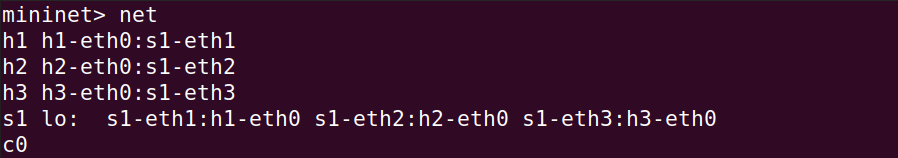

- **h1, h2** → Whitelisted (authorized hosts)
- **h3** → Not whitelisted (unauthorized host, all traffic blocked)
- **s1** → Single OpenFlow switch
- **c0** → Remote POX controller

---

## Setup & Execution

### Prerequisites

- Linux OS (Ubuntu 20.04 / 22.04 preferred)
- [Mininet](http://mininet.org/download/)
- [POX controller](https://github.com/noxrepo/pox)
- Python 3
- Wireshark (optional, for packet capture)

### System Preparation

Before installing Mininet, ensure the system is updated:

```bash
sudo apt update
sudo apt upgrade -y
```

This ensures all packages are up to date and avoids any dependency issues.

### Installing Mininet

Install Mininet using Ubuntu's package manager:

```bash
sudo apt install mininet -y
```

This will automatically install Mininet and all its dependencies.

### Steps

**1. Clone POX**
```bash
git clone https://github.com/noxrepo/pox.git
```

**2. Clone this repository (if not already done)**
```bash
git clone https://github.com/ananya97br/SDN-access-control-system.git
```

**3. Copy the controller file to POX**
```bash
cp SDN-access-control-system/access_control.py pox/ext/
```

**4. Start the POX controller**
```bash
cd pox
python3 pox.py log.level --DEBUG access_control
```

**5. In a new terminal, start the Mininet topology**
```bash
sudo mn --controller=remote --topo single,3
```

---

## Whitelist Configuration

Authorized hosts are defined directly in `access_control.py`:

```python
WHITELIST = ["10.0.0.1", "10.0.0.2"]  # h1 and h2 are authorized
```

`h3 (10.0.0.3)` is intentionally excluded to demonstrate blocking behavior.

---

## Output

### Controller logs (POX terminal)

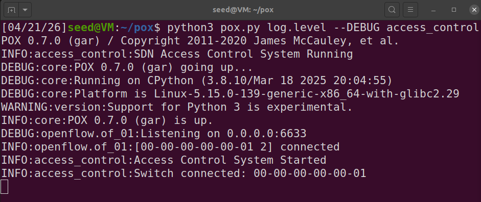

### Mininet — pingall

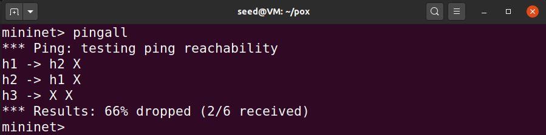

 h1 ↔ h2 communicate successfully. h3 is blocked from reaching anyone.

---

## Screenshots & Test Scenarios

### Scenario 1 — Controller & Mininet Startup
POX controller running, switch connected, Mininet topology created with 3 hosts (h1, h2, h3) and 1 switch.

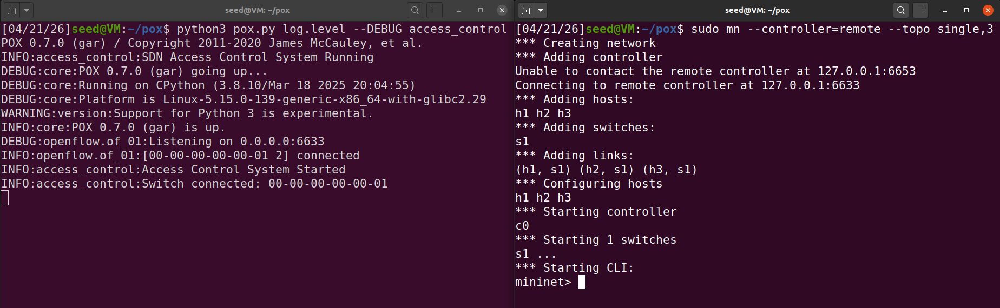

---

### Scenario 2 — Network Topology (`net`)
Confirms topology: h1, h2, h3 each connected to s1 via dedicated interfaces.

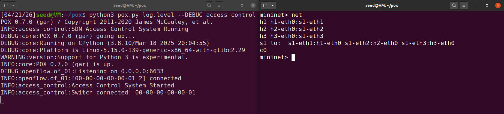

---
### Scenario 3 — pingall (Access Control Verification)
`pingall` confirms h1 ↔ h2 are reachable, h3 is fully blocked. Controller logs show ALLOWED for 10.0.0.1/10.0.0.2 and BLOCKED for 10.0.0.3.

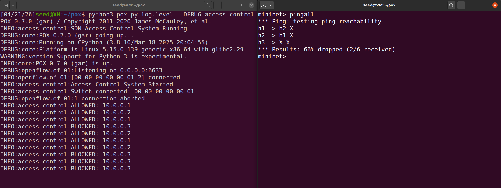

---

### Scenario 4 — Authorized: h1 → h2 (ALLOWED)
`h1 ping -c 3 h2` succeeds with 0% packet loss. Controller logs show repeated ALLOWED entries for both IPs.

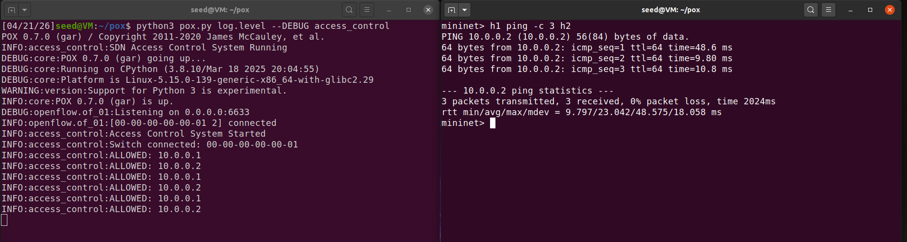

---

### Scenario 5 — Authorized: h2 → h1 (ALLOWED)
`h2 ping -c 3 h1` succeeds with 0% packet loss, confirming bidirectional access between whitelisted hosts.

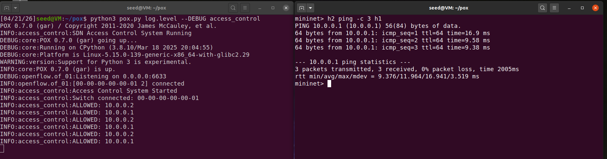

---

### Scenario 6 — Unauthorized: h3 → h2 (BLOCKED)
`h3 ping -c 3 h2` results in 100% packet loss. Controller logs show BLOCKED for 10.0.0.3.

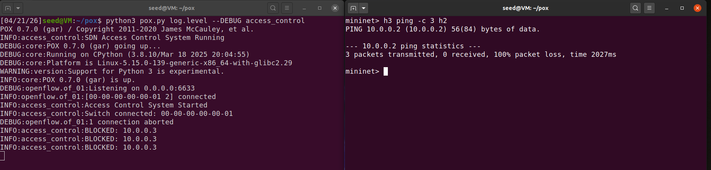

---

### Scenario 7 — Unauthorized: h3 → h1 (BLOCKED)
`h3 ping -c 3 h1` also results in 100% packet loss, confirming h3 is blocked from all destinations.

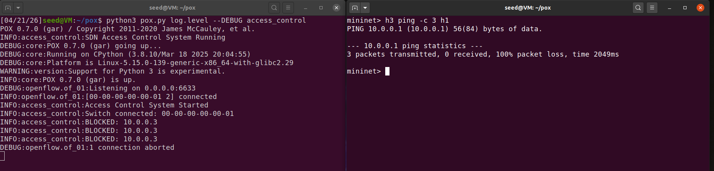

---

### Scenario 8 — Wireshark Packet Capture
ICMP traffic captured on interface `s1-eth1`. Shows Echo requests from 10.0.0.1 → 10.0.0.2 with replies, confirming allowed traffic flows correctly at the packet level.

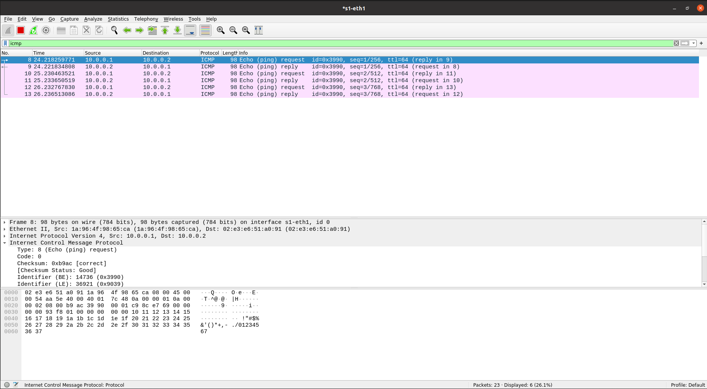

---

## Regression Test

| Test |        Source        |      Destination     |    Expected    |   Result   |
|------|----------------------|----------------------|----------------|------------|
|  1   | h1 (10.0.0.1)        | h2 (10.0.0.2)        | ALLOWED        |    Pass    |
|  2   | h2 (10.0.0.2)        | h1 (10.0.0.1)        | ALLOWED        |    Pass    |
|  3   | h3 (10.0.0.3)        | h2 (10.0.0.2)        | BLOCKED        |    Pass    |
|  4   | h3 (10.0.0.3)        | h1 (10.0.0.1)        | BLOCKED        |    Pass    |
|  5   | pingall              | all hosts            | h1↔h2 only     |    Pass    |

Consistent across all test runs — whitelisted hosts always allowed, unauthorized hosts always blocked.

---

## How It Works

1. **Switch connects** → Controller registers `ConnectionUp` event
2. **Packet arrives** → `packet_in` event fired at controller
3. **ARP packets** → Always flooded (so hosts can resolve IPs)
4. **IPv4 packets** → Source IP checked against `WHITELIST`
   - If in whitelist → `ofp_packet_out` with `OFPP_FLOOD` action (allow)
   - If not in whitelist → `ofp_packet_out` with no actions (drop/block)
5. **Logs** → Every decision logged as ALLOWED or BLOCKED

---

## Conclusion

The SDN-Based Access Control System successfully enforced host-level access control using POX and Mininet. Whitelisted hosts h1 and h2 communicated freely with 0% packet loss, while unauthorized host h3 was completely blocked — confirmed through ping tests, controller logs, and Wireshark capture. All regression tests passed consistently, demonstrating that centralized SDN policy enforcement is simpler, more flexible, and more consistent than traditional network-level access control.
